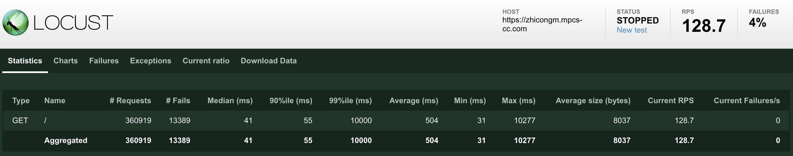
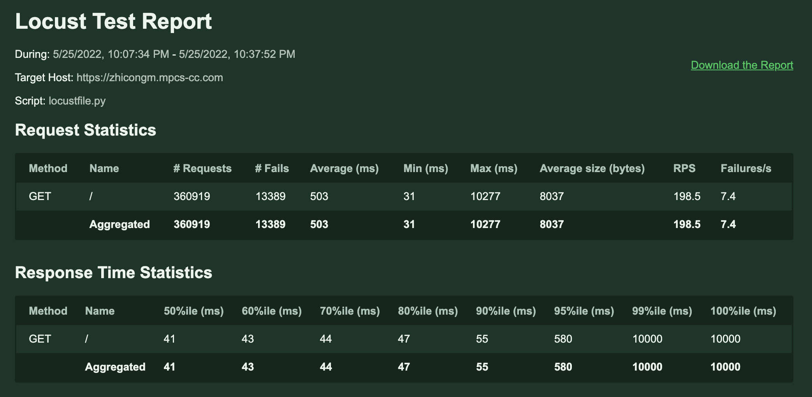
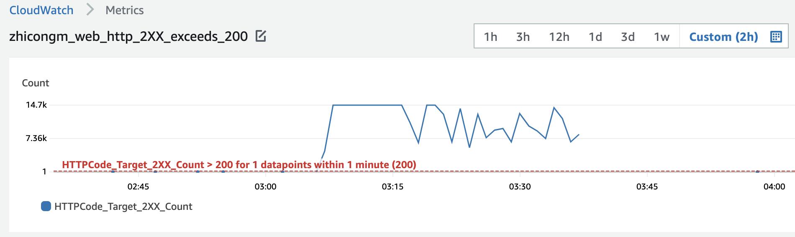
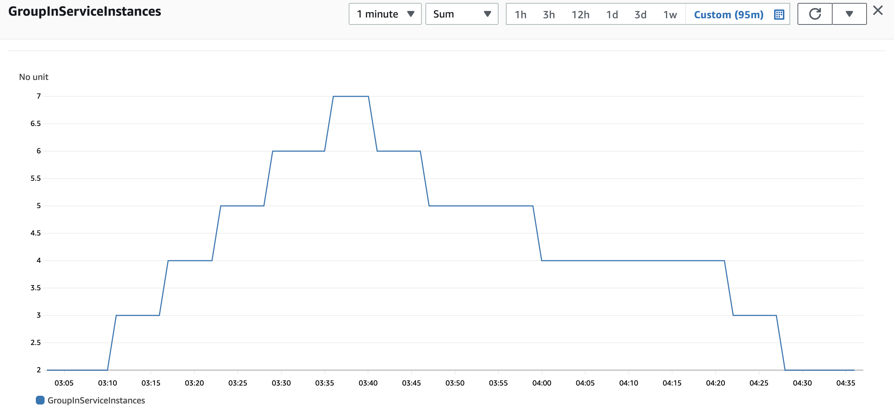
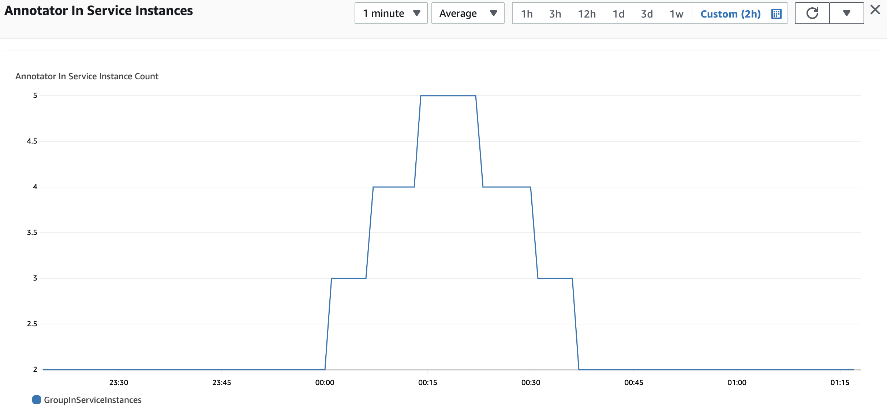

# Genomics Annotation Service

## 🧬 Overview
An enhanced web framework (based on [Flask](http://flask.pocoo.org/)) for use in the capstone project. Adds robust user authentication (via [Globus Auth](https://docs.globus.org/api/auth)), modular templates, and some simple styling based on [Bootstrap](http://getbootstrap.com/).

Directory contents are as follows:
* `/web` - The GAS web app files
* `/ann` - Annotator files
* `/util` - Utility scripts for notifications, archival, and restoration
* `/locust` - locust files for autoscaling test

## 🧬 Archive Process
A delayed queue (job archive SQS) whose "delivery delay" is set to be 5 minutes, is subscribed to the job results SNS. When a job is finished, a notification will be published to the job results SNS and the job archive SQS will get a message five minutes later.  

The ```archive.py``` has the following steps:  
1. Continuously poll messages from job archive SQS. If the message is not empty, proceed to Step 2.
2. Check the user role. If premium user, simply delete the message and return to Step 1. If free user, proceeds to Step 3.
3. Get the results file from S3 and upload it to Glacier. 
4. Get results_file_archive_id from the upload response of Glacier in Step 3 and update it to DynamoDB. An attribute called "available_in_glacier" is also created and updated to DyanmoDB. This attribute is True when the results file is archived in Glacier and False if it is not. At this step, the "available_in_glacier" attribute is set to be True.
5. Delete the archived results file in S3.
6. Delete current message and return to Step 1.

## 🧬 Restore Process
When a free user upgrades to a premium user, the restore process starts. The ```/subscribe``` route of ```views.py``` send a notification to the restore start SNS. A restore start SQS is subscribed to this SNS. 

The ```restore.py``` and ```thaw.py``` have the following steps:  
1. Continuously poll messages from restore start SQS. If the message is not empty, proceed to Step 2.
2. Get user_id from the message. Then get all the archive_ids under the current user_id from DynamoDB. 
3. For each achive_id and the related job information, retrieve the corresponding results file from Glacier. The related job information is stored in the "description" parameter of the retrieval request sent to Glacier. Expedited retrieval is used in default, if exception met, it will be automatically changed to Standard retrieval. When the retrieval is done, Glacier will send a notification to the restore complete SNS. Therefore the ```thaw.py``` can poll a message from the restore complete SQS, get job output from Glacier and restore the results file to S3. After the restoring, ```thaw.py``` will update the "available_in_glacier" attribute in DyanmoDB to False and delete the message. 
4. Delete current message from the restore start SQS.   

## 🧬 Autoscaling Tests
### ✨ Load test the web server farm
I run Locust tests towards the home page ("/") with 500 users @ 30 users/second.

The Locust tests page:


The Locust report:


The web server alarm (triggers when the sum of successful responses exceeds 200 for one minute):  


The in-service instance count of web server during this period:  


### ✨ Load test the annotator farm
The ```ann_load.py``` file in ```util``` folder is used to automatically submit job requests to the annotator. The way to run ```ann_load.py``` is to navigate to the ```util``` folder and run ```python3 ann_load.py <request_count>```, where ```<request_count>``` is the number of requests you want to send to the annotator. The gap (sleep time) between each request is set to be 5 minutes.

In order to observe the auto scaling process of annotators, I sent 200 job requests to the annotators by ```ann_load.py```. 

 The annotator alarm graph (alarm triggered when more than 50 messages are sent to the job request SQS in 10 minutes):


The in-service annotator instance count during this period:


## 🧬 Notes
- This project is using UTC time for all timestamps.
